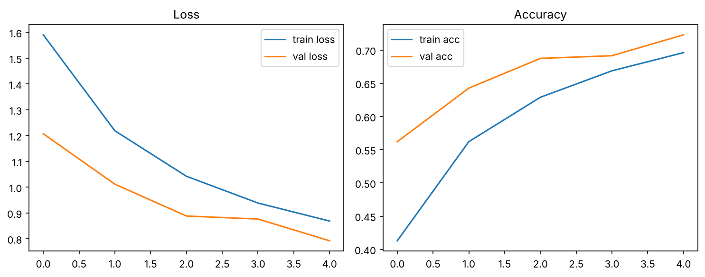
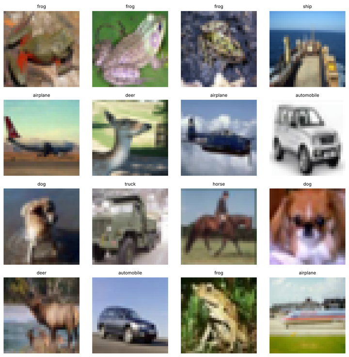

# CIFAR-10 Image Classifier (PyTorch)

A small convolutional network trained from scratch to sort 32×32 colour images into CIFAR-10's ten
classes: airplane, automobile, bird, cat, deer, dog, frog, horse, ship and truck. It's written to be
read: every step of the training loop is commented, from data loading to backprop to checkpointing.

## Result

**72.3% test accuracy after the default 5 epochs**, in about 4 minutes on a 4-thread CPU. Random
guessing scores 10%.

| Epoch | Train loss | Train acc | Test loss | Test acc |
|---:|---:|---:|---:|---:|
| 1 | 1.591 | 41.3% | 1.207 | 56.2% |
| 2 | 1.219 | 56.2% | 1.012 | 64.3% |
| 3 | 1.043 | 62.9% | 0.888 | 68.8% |
| 4 | 0.939 | 66.9% | 0.877 | 69.2% |
| 5 | 0.869 | 69.6% | 0.792 | **72.3%** |

From one run of `train.py` with its defaults, seeded with `torch.manual_seed(0)`. The script doesn't set a
seed itself, so expect small differences between runs. Test accuracy beats training accuracy because training
images are randomly cropped and flipped and dropout is active, while test images are not. Accuracy is
still rising at epoch 5, so `--epochs 20` should land noticeably higher.

<p align="center"></p>

<p align="center"></p>

## The model

`SmallCNN` in [`model.py`](model.py), about 620k parameters:

```text
input 3×32×32
→ Conv 3→32,  ReLU, MaxPool   → 32×16×16
→ Conv 32→64, ReLU, MaxPool   → 64×8×8
→ Conv 64→128, ReLU, MaxPool  → 128×4×4
→ Flatten → Linear 2048→256, ReLU, Dropout 0.2 → Linear 256→10
```

**Training** ([`train.py`](train.py)):
- Adam, learning rate 1e-3, batch size 128, cross-entropy loss, 5 epochs by default.
- Augmentation on the training set: random crop with 4 px padding, plus horizontal flips. Inputs are normalised with CIFAR-10's channel means and standard deviations.
- After every epoch the model is evaluated on the 10,000 test images; the best weights go to `checkpoints/best.pt`.

## Run it

```bash
pip install torch torchvision matplotlib numpy
python train.py                     # 5 epochs; downloads CIFAR-10 (~170 MB) on first run
python train.py --epochs 20 --show-batch
```

| Flag | Default | |
|---|---|---|
| `--epochs` | 5 | Training epochs |
| `--batch-size` | 128 | Training batch size |
| `--lr` | 1e-3 | Adam learning rate |
| `--data-dir` | `./data` | Where CIFAR-10 is stored |
| `--num-workers` | 2 | DataLoader workers |
| `--show-batch` | off | Also show a grid of augmented training images |

It uses a CUDA GPU automatically when one is available.

[`Abstract.txt`](Abstract.txt) is a plain-English walkthrough of the whole workflow: what a tensor
image is, what each layer does, what an epoch is.

## Stack

Python · PyTorch · torchvision · matplotlib
